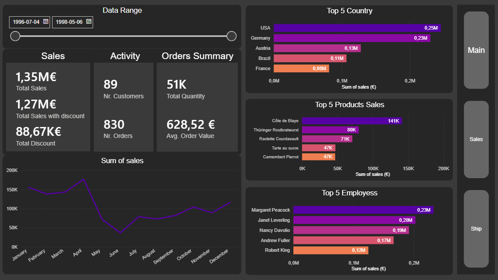
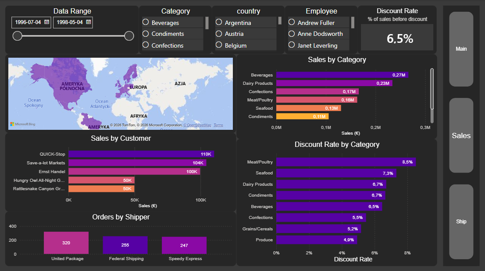

# northwind-traders-data-analytics

Fresh look at the classic **Northwind Traders** dataset (PostgreSQL).  
Private / portfolio project: **RAW (public) → SILVER → GOLD (star schema views) → Power BI Sales Dashboard (3 pages)**.

The goal is to showcase an end-to-end analytics workflow: data layering in SQL, analytics-ready modeling (fact + dimensions), KPI definitions, basic quality checks, and business insights delivered in Power BI.

---

## Dashboard preview (Power BI)

**Sales Performance Dashboard (3 pages): Main / Sales / Ship**

<!-- Główne zdjęcie -->

  

  
  

[ZDJĘCIE: Power BI model view (star schema) — bi/model-powerbi.png]

Quick links:
- [LINK: Power BI file (.pbix) — bi/dashboard-sales.pbix]
- [LINK: Dashboard conclusions / insights — docs/dashboard/dashboard-review.md]

---

## Highlights

- Built SQL layers (**silver** cleanup + **gold** reporting views) on top of RAW `public`
- Designed a **star schema** for BI reporting (fact + dimensions)
- Implemented consistent **Gross / Net / Discount** logic for sales KPIs
- Added **data quality checks** (keys, joins, basic integrity and sanity checks)
- Delivered a 3-page dashboard covering **sales drivers**, **discount impact**, and **shipping performance**

---

## Data model (Gold → Power BI)

- **Fact:** `gold_fact_sales`  
  Grain: **1 row = 1 order line** (order_id + product_id)
- **Dimensions:** customers, products (+ categories), employees, shippers, date

[LINK: SQL gold script — scripts/gold/]

---

## Key KPIs (examples)

- Total Sales (Net)  
- Total Sales (Gross / pre-discount)  
- Discount Amount  
- Discount Rate  
- Orders  
- Customers  
- Avg Order Value (AOV)  
- Ship on Time %  
- Avg Days to Ship  

(Definitions and page-level interpretation are described in:  
[LINK: docs/dashboard/dashboard-review.md])

---

## How to run (local)

### Prerequisites
- PostgreSQL + pgAdmin4 (or psql)
- Power BI Desktop

### Data source
- Download: [LINK: Northwind .backup source]
- Restore in pgAdmin4:
  1) Create database `northwind` (or your preferred name)
  2) Right click the database → **Restore…** → select the `.backup` file
  3) After restore, confirm tables exist in schema `public`

### Build SILVER and GOLD
1) **SILVER (tables + load/cleanup)**
   - Run: `scripts/silver/ddl_silver.sql`
   - Run: `scripts/silver/load_silver.sql`

2) **GOLD (analytics views for Power BI)**
   - Run the script(s) in: `scripts/gold/`

3) **Quality checks (optional)**
   - Run scripts from: `tests/`
   - Business rules / documentation: `docs/`

### Open the dashboard
- Open: `bi/dashboard-sales.pbix`
- Refresh data (Import mode) against your PostgreSQL database

---

## Repository structure

---

## Roadmap (planned)

Next step: **Python EDA** to answer “why” questions raised in the dashboard review (drivers of spikes/declines, mix effects, discount effectiveness).  
[LINK: eda/]

---

## License
MIT — see `LICENSE`.

